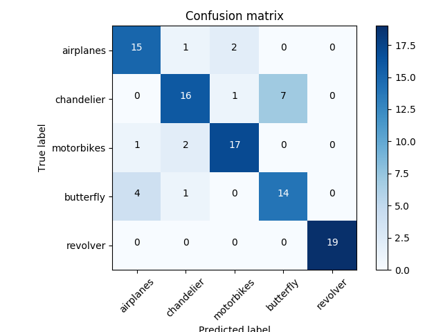

# BagOfVisualWords
Image categorization using Bag of visual words approach.

Uses opencv python-contrib SIFT for feature extraction and scikit-learn's SVM.

This is python implementation of Bag of visual words model, which again
is based on the paper by Csurka et al[1].

Please refer [here](https://ymdatta.github.io/2018/08/19/bag-of-visual-words.html),
for details regarding implementation of the model.

#### Things you need to install before running:

* pickle
* scikit-learn
* opencv-contrib (it contains sift implementation)
* numpy
* matplotlib

#### Project architecture:

      -BagOfVisualWords/
            |- images/
                      |-train/
                              |-category 1
                              |-category 2
                              |-etc
                      |-test/
                              |-category 1
                              |-category 2
                              |-etc
                      |-kmeans/
                              |-category 1
                              |-category 2
                              |-etc
            |- bag_of_words.py
            |- read_files.py
            |- plot_data.py
            |- all other python and sav files.

##### Things to remember before running:

1. Change the path to images in the read_files.py file, to point
   to the directory containing test, train, kmeans images.

2. Change the path in the KMeans_clustering.py to point to the
   directory containing kmeans images.

##### Usage:

`python bag_of_words.py`

##### Additional Information:

* I have also included the cluster center files, which were obtained using KMeans_clustering from the sift features of 1000 images.
* They are named as bov_pickle_Numberofclustercentres.py. (Number of clusters being 200, 400, 600, 800). Feel free to use them.

* All the data required for testing, training and also for vocabulary
  building has been collected from mostly [Caltech101](http://www.vision.caltech.edu/Image_Datasets/Caltech101/) and few images from [Caltech256](http://www.vision.caltech.edu/Image_Datasets/Caltech256/).

### Results:

|Number of categories | Accuracy | No of clusters used |
|---------------------| -------- | ------------------- |
|        3            |    83%   |       600           |
|        3            |    85%   |       800           |
|        4            |    76%   |       600           |
|        4            |    76%   |       800           |
|        5            |    81%   |       600           |
|        5            |    80%   |       800           |
|        6            |    67%   |       600           |
|        6            |    67%   |       600           |

* Please check the results folder for the confusion matrices obtained.
  ex: confusion matrix of 5 categories with 600 clusters.

.

Documentation:
* Each python file contains the information about what each function does, what
  arguements each fucntion takes and how they can be tweaked.

References:
* (1)[https://www.cs.cmu.edu/~efros/courses/LBMV07/Papers/csurka-eccv-04.pdf].

Feel free to open an [Issue](https://github.com/ymdatta/BagOfVisualWords/issues)
if you face any problem. :)
